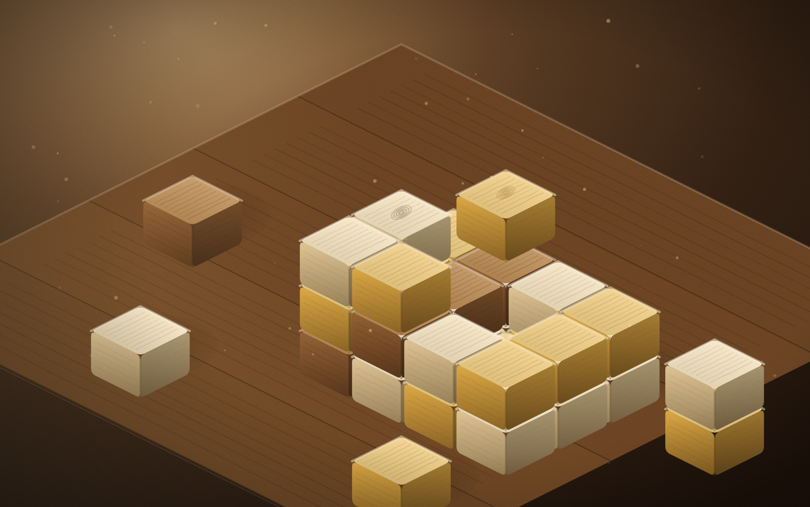
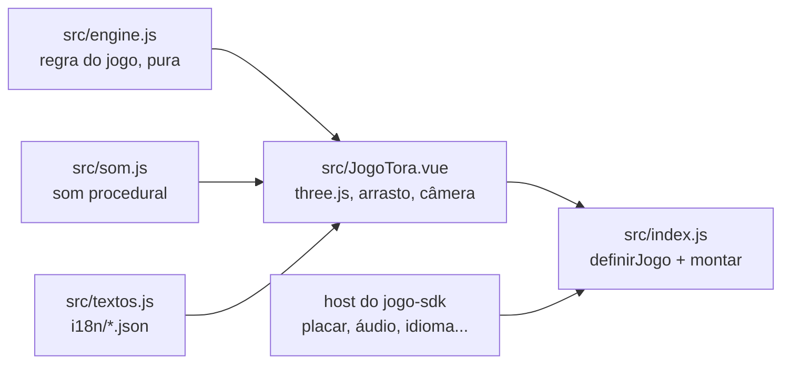

# Tora

O TORA do [RoqueOS](https://roqueos.com.br): um quebra-cabeça de encaixe com blocos de madeira
em 3D. Arraste as peças da bandeja para o tabuleiro, complete fileiras e colunas para limpá-las
e sobreviva às jogadas de cada nível. Jogue em
[roqueos.com.br/jogar/tora](https://roqueos.com.br/jogar/tora).

_English below._

## Por que existe

Até 25/09/2026 este jogo morava dentro do repositório do RoqueOS e importava as stores do
sistema direto. Agora ele é um repo próprio na organização
[roqueos-games](https://github.com/roqueos-games), aberto, e fala com o RoqueOS só pelo
[`jogo-sdk`](https://github.com/roqueos-games/jogo-sdk). O mesmo código roda no RoqueOS,
sozinho no seu navegador (`yarn dev`) e no teste.

## Como se joga

Tabuleiro de 8 por 8 e uma bandeja com três peças. As peças não giram: cada uma entra como
aparece.

| Ação                 | Mouse                      | Toque                      |
| -------------------- | -------------------------- | -------------------------- |
| começar              | clique em Jogar            | toque em Jogar             |
| encaixar uma peça    | arraste da bandeja e solte | arraste da bandeja e solte |
| girar a vista        | arraste num lugar vazio    | arraste num lugar vazio    |
| aproximar ou afastar | roda do mouse              | pinça com dois dedos       |
| som e recomeçar      | os dois botões no alto     | os dois botões no alto     |

Não há controle por teclado. Cada casa encaixada vale 1 ponto; cada casa limpa vale 10, vezes o
número de linhas limpas na mesma jogada, vezes a sequência de jogadas seguidas que limpam. Cada
nível pede um número de jogadas (13 no primeiro, 3 a mais a cada nível) e sorteia peças maiores
com mais frequência. O jogo acaba quando nenhuma das peças da bandeja cabe em lugar nenhum.

## Arquitetura

- `src/engine.js` é a regra do jogo, sem Vue, sem DOM e sem `Math.random`: tabuleiro de 8 por
  8, bandeja de três peças sorteadas pela semente, limpeza de linha e coluna, pontuação, níveis
  e a garantia de que a bandeja recém-sorteada tem ao menos uma peça que cabe. Todo lance é
  reproduzível no teste.
- `src/JogoTora.vue` desenha o tabuleiro de madeira com [three.js](https://threejs.org) e ouve
  o ponteiro: arrastar peça, girar a vista, zoom. Tudo o que vem do sistema (recorde da conta,
  áudio, perfil de aparelho fraco, métrica, idioma) chega pelo `host`. No perfil leve o jogo
  nasce sem antialias, sem sombra, sem partículas, com material mais simples e pixel ratio
  menor.
- `src/index.js` cria um app Vue próprio dentro do elemento que o host entrega e devolve
  `{ ativar, desmontar }`. A janela sem foco para de desenhar; desmontar solta o laço, os
  ouvintes e o contexto WebGL.
- `jogo.json` é o manifesto: nome e descrição nos dez idiomas, SEO, etiquetas, capa, ícone,
  tamanho de janela e a chave do recorde. O RoqueOS confere que ele bate com o catálogo.

O `three` é `peerDependency`: o RoqueOS fornece o dele, e o jogo não traz outro. A versão exata
em `devDependencies` é a mesma que o RoqueOS instala, para o teste e o `yarn dev` verem o que
o jogador vê.

## Pré-requisitos

- Node 24 (o `.nvmrc` diz), ou 22 no mínimo.
- Yarn 1.22.

## Como rodar

1. `yarn install --ignore-scripts`
2. `yarn dev` e abra o endereço que o Vite mostrar: o jogo roda com o host de
   desenvolvimento do SDK, com o recorde no `localStorage`.
3. `yarn verificar` antes de abrir PR: lint, formato, testes e o `jogo check`, o mesmo que o
   CI roda.

O teste roda no jsdom, que não tem WebGL: o `three` é trocado por um dublê
(`test/threeStub.js`). Verde no teste não diz nada sobre o desenho na GPU. Mudança no código
que toca a GPU (renderer, materiais, texturas, luzes, sombras, pixel ratio, perfil leve)
precisa ser vista num iPhone de verdade antes de subir.

## Estrutura

| Caminho              | O que é                                                                |
| -------------------- | ---------------------------------------------------------------------- |
| `src/`               | o jogo (motor, tela, som, ícones, textos, entrada)                     |
| `i18n/`              | um JSON por idioma, com as mesmas chaves nos dez                       |
| `public/`            | capa e ícone; a origem de cada arquivo está no [ASSETS.md](ASSETS.md)  |
| `test/`              | testes com o host falso do SDK e o dublê do three, sem nada do RoqueOS |
| `dev/`, `index.html` | o jogo sozinho no navegador, para desenvolver                          |
| `jogo.json`          | o manifesto que o RoqueOS lê                                           |

## Onde ele se encaixa

O RoqueOS instala este repo por uma tag exata e monta o jogo pelo `mount` do SDK, na janela
do desktop e em `/jogar/tora`. Uma mudança aqui só chega ao RoqueOS quando uma tag nova é
pinada lá, depois de revisada. As chaves de armazenamento (`best`, `muted`), os nomes de
evento (`game_start`, `game_over`) e o gancho de QA `window.__tora` não mudam: o recorde de
quem já joga, o histórico de uso e o QA do RoqueOS dependem deles.

## Licença

MIT, no código e na arte própria. Veja [LICENSE](LICENSE) e [ASSETS.md](ASSETS.md).

---

## English

TORA from [RoqueOS](https://roqueos.com.br): a 3D wooden block-fitting puzzle. Drag pieces
from the tray onto the 8×8 board, fill whole rows or columns to clear them, and survive each
level's placements. It talks to RoqueOS only through the
[`jogo-sdk`](https://github.com/roqueos-games/jogo-sdk), so the same code runs inside
RoqueOS, standalone in your browser and in tests.

- `yarn install --ignore-scripts`, then `yarn dev` to play it locally.
- `yarn verificar` runs lint, formatting, tests and `jogo check`, exactly like CI.
- Controls: drag a tray piece onto the board; drag empty space to orbit the view; mouse wheel
  or pinch to zoom. There are no keyboard controls. Pieces do not rotate.
- `three` is a peer dependency: RoqueOS provides its own copy.
- Tests run in jsdom with a three.js stub, so they say nothing about GPU rendering. Changes
  to renderer, materials, textures, lights, shadows, pixel ratio or the low-end profile need
  to be seen on a real iPhone before they ship.
- Code and comments are in Brazilian Portuguese; issues and pull requests in English are
  welcome.
- Storage keys (`best`, `muted`), event names (`game_start`, `game_over`) and the
  `window.__tora` QA hook are stable on purpose: existing players' records, analytics and
  RoqueOS QA depend on them.

MIT licensed, code and original art.
